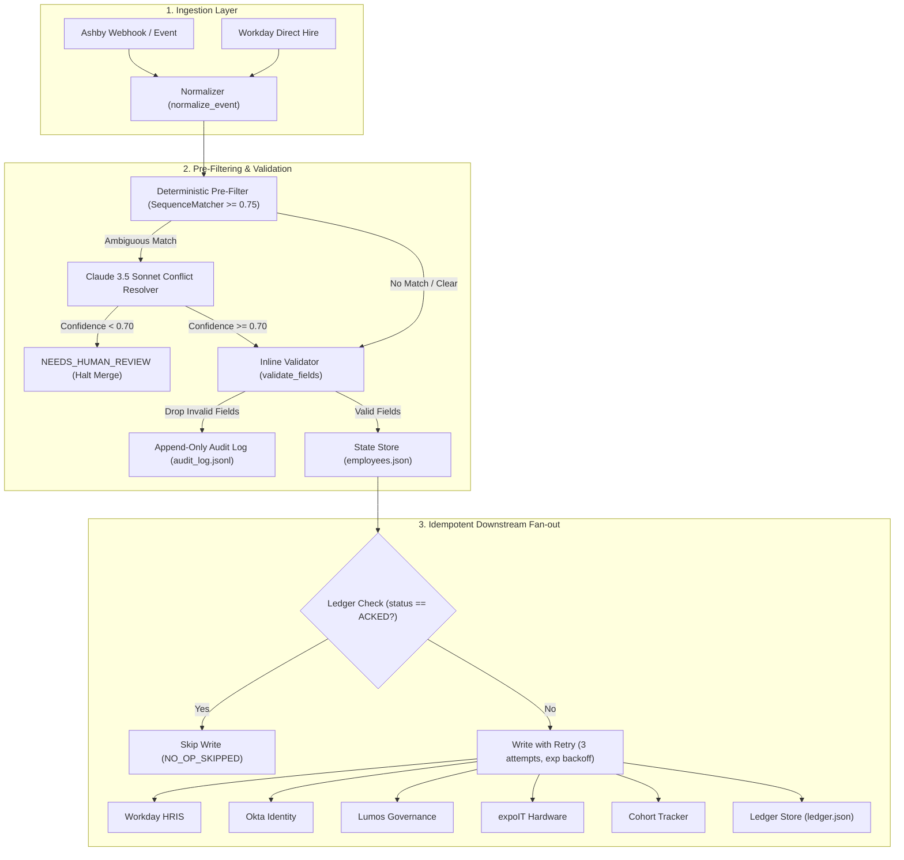

# BetterUp Sync Engine: Change Propagation Prototype

An event-driven Change Propagation engine for BetterUp onboarding lifecycle orchestration across Ashby, Workday, Okta, Lumos, expoIT, and Cohort Tracker.

---

## Architecture Overview



---

## Key Features

1. **Deterministic Pre-Filtering & Inline Validation**:
   - `is_near_duplicate()` detects potential hire collisions ($\ge 0.75$ name similarity on same start date) before calling LLMs.
   - `validate_fields()` validates names, addresses, and dates inline, dropping invalid fields into audit logs while propagating healthy fields.
2. **Confidence-Gated Google Gemini Integration**:
   - Disambiguates complex identity conflicts with structured JSON outputs (`same_person`, `different_person`, `needs_human_review`) via `GeminiHandler` (`gemini-2.5-flash`).
   - Automatically overrides decisions if confidence $< 0.70$ or JSON parsing fails.
3. **Cryptographic Idempotency & Fault-Isolated Retries**:
   - SHA-256 idempotency keys prevent duplicate downstream writes.
   - Exponential backoff with injectable clock fixtures.
   - Downstream failures in one system (e.g. expoIT) do not block writes to healthy systems.
4. **Append-Only Audit Logging & Ledger**:
   - Tracks all state transitions (`FIELD_CHANGE_PROPAGATED`, `VALIDATION_REJECTED`, `NO_OP_SKIPPED`, `CLAUDE_CONFLICT_RESOLVED`, `NEEDS_HUMAN_REVIEW`) in `data/audit_log.jsonl`.
5. **Model Context Protocol (MCP) Server**:
   - Stdio MCP tool `resolve_identity_conflict` exposing identity disambiguation directly to AI desktop clients and IDE subagents.

---

## Installation & Setup

### 1. Requirements
- Python 3.11+ (tested on Python 3.11 and Python 3.14)
- Core dependencies: `pydantic>=2.0,<3.0`, `google-genai>=0.1.0`, `pytest>=8.0`, `python-dotenv>=1.0`, `mcp>=1.2.0,<2.0.0`

### 2. Environment Setup
```powershell
# Create and activate virtual environment
python -m venv .venv
.\.venv\Scripts\Activate.ps1

# Install dependencies
pip install -r requirements.txt

# Configure environment variables (optional for air-gapped unit tests)
cp .env.example .env
```

---

## Running the CLI

The CLI provides full normalization, validation, dry-run simulation, and execution summaries:

```powershell
# Process an event with dry-run (no state changes)
python -m src.main --event sample_events/name_change.json --dry-run

# Process an event live
python -m src.main --event sample_events/name_change.json --data-dir data/

# Run other sample events
python -m src.main --event sample_events/address_change.json
python -m src.main --event sample_events/start_date_change.json
python -m src.main --event sample_events/offcycle_hire.json
python -m src.main --event sample_events/ambiguous_name_conflict.json
```

---

## Running Tests

### 1. Air-Gapped Default Suite (Zero network calls, fast execution)
```powershell
pytest
```
*Executes all 37 unit tests across all 10 modules in $< 2\,\text{seconds}$.*

### 2. Live Anthropic API Integration Test
```powershell
# Requires ANTHROPIC_API_KEY set in environment or .env
pytest -m integration
```

---

## Model Context Protocol (MCP) Server

Launch the stdio MCP server:
```powershell
python -m src.mcp_server
```

**Registered Tool**:
- `resolve_identity_conflict(record_a: dict, record_b: dict, context: str)` $\rightarrow$ `{"decision": str, "confidence": float, "reasoning": str}`

---

## Repository Structure

```
.
├── Problemstatement.txt     # Complete requirements specification (v2)
├── README.md                # Project documentation & execution guide
├── architecture.md          # Detailed architectural blueprint
├── build_note.md            # Design decisions & productionization notes
├── context.md               # Technical specifications & constraints
├── edge-case.md             # Edge-case analysis & mitigations
├── implementation_plan.md   # 11-phase implementation plan
├── pytest.ini               # Pytest marker configuration
├── requirements.txt         # Pinned project dependencies
├── systems_map.md           # Systems mapping & failure modes analysis
├── data/                    # State directory (employees.json, ledger.json, audit_log.jsonl)
├── sample_events/           # Literal test event JSON fixtures
│   ├── address_change.json
│   ├── ambiguous_name_conflict.json
│   ├── name_change.json
│   ├── offcycle_hire.json
│   └── start_date_change.json
├── src/
│   ├── audit_log.py         # Append-only JSONL audit logger
│   ├── claude_handler.py    # Claude 3.5 Sonnet conflict resolver & confidence gating
│   ├── main.py              # CLI entrypoint with dry-run support
│   ├── mcp_server.py        # Model Context Protocol stdio server
│   ├── models.py            # Pydantic v2 domain schemas
│   ├── state_store.py       # Atomic file storage & needs_attention tracking
│   ├── sync_engine.py       # Event normalization, fanout & retry orchestrator
│   ├── validators.py        # Inline field validator & SequenceMatcher pre-filter
│   └── connectors/          # Downstream mock connector implementations
│       ├── base.py
│       ├── fake_expoit.py
│       ├── fake_lumos.py
│       ├── fake_okta.py
│       ├── fake_tracker.py
│       └── fake_workday.py
└── tests/                   # Complete test suite (38 tests)
    ├── conftest.py
    ├── test_audit_log.py
    ├── test_claude_conflict.py
    ├── test_cli.py
    ├── test_idempotency.py
    ├── test_mcp_server.py
    ├── test_offcycle_backfill.py
    ├── test_partial_failure.py
    ├── test_phase1.py
    ├── test_phase2.py
    ├── test_phase4.py
    └── test_validation.py
```
