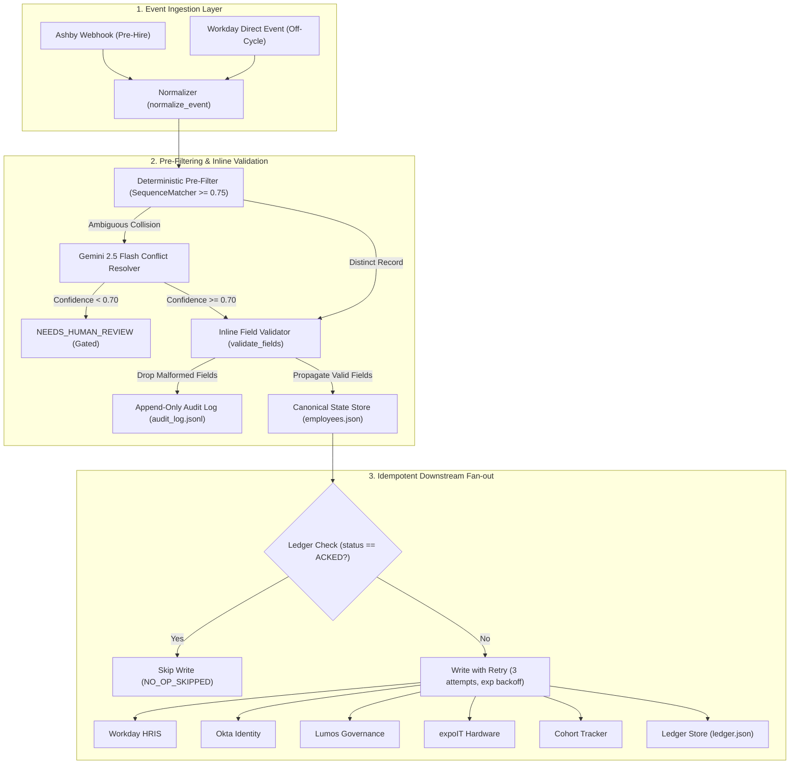

# BetterUp Sync Engine — Change Propagation & Identity Intelligence

[](https://better-up-ebon.vercel.app/)
[](https://www.python.org/)
[](https://ai.google.dev/)

An event-driven Change Propagation engine designed for BetterUp onboarding lifecycle orchestration across Ashby (ATS), Workday (HRIS), Okta (IdP), Lumos (Access Governance), expoIT (Hardware Logistics), and Cohort Tracker.

🌐 **Live Deployed Dashboard**: [https://better-up-ebon.vercel.app/](https://better-up-ebon.vercel.app/)

---

## Architecture Overview



---

## Core Engineering Highlights

1. **Deterministic Pre-Filtering & Inline Validation**:
   - `is_near_duplicate()` detects potential hire collisions ($\ge 0.75$ name similarity on same start date) before making any external calls.
   - `validate_fields()` validates names, addresses, and dates inline, dropping invalid fields into audit logs while propagating healthy fields in the same payload without blocking the event.
2. **Confidence-Gated Google Gemini Integration**:
   - Disambiguates complex identity conflicts with structured JSON outputs (`same_person`, `different_person`, `needs_human_review`) via `GeminiHandler` (`gemini-2.5-flash`).
   - Automatically overrides decisions if confidence $< 0.70$ or JSON parsing fails.
3. **Cryptographic Idempotency & Fault-Isolated Retries**:
   - Deterministic SHA-256 idempotency keys prevent duplicate downstream writes across all downstream connectors.
   - Exponential backoff with injectable clock fixtures (`sleep_fn = lambda _: None`) for instantaneous test execution.
   - Downstream failures in one system (e.g. expoIT) do not block writes to healthy systems.
4. **Append-Only Audit Logging & Ledger**:
   - Immutable audit trail tracking all state transitions (`FIELD_CHANGE_PROPAGATED`, `VALIDATION_REJECTED`, `NO_OP_SKIPPED`, `CLAUDE_CONFLICT_RESOLVED`, `NEEDS_HUMAN_REVIEW`) in `data/audit_log.jsonl`.
5. **Interactive Dashboard & CLI**:
   - **CLI Interface**: Full `--dry-run` simulation, event inspection, and POSIX exit codes (0/1).
   - **Web UI Dashboard**: Live visual pipeline flow, employee store viewer, idempotency ledger triage, and Gemini AI sandbox.
6. **Model Context Protocol (MCP) Server**:
   - Stdio MCP tool `resolve_identity_conflict` exposing identity disambiguation directly to AI desktop clients and IDE subagents.

---

## Installation & Setup

### 1. Requirements
- Python 3.11+ (tested on Python 3.11 and Python 3.14)
- Dependencies: `pydantic>=2.0,<3.0`, `google-genai>=0.1.0`, `fastapi>=0.110.0`, `pytest>=8.0`, `python-dotenv>=1.0`, `mcp>=1.2.0,<2.0.0`

### 2. Quickstart
```powershell
# Create and activate virtual environment
python -m venv .venv
.\.venv\Scripts\Activate.ps1

# Install dependencies
pip install -r requirements.txt

# Configure environment variables
cp .env.example .env
```

---

## Running the Application

### 1. Live Web Dashboard (Vercel)
The interactive dashboard is live on Vercel:
🌐 **[https://better-up-ebon.vercel.app/](https://better-up-ebon.vercel.app/)**

### 2. Local Backend API & Dashboard
Launch locally on [http://127.0.0.1:8000](http://127.0.0.1:8000):
```powershell
python -m uvicorn server:app --reload --port 8000
```

### 3. Command Line Interface (CLI)
```powershell
# Run dry-run simulation (no writes or state changes)
python -m src.main --event sample_events/name_change.json --dry-run

# Run live event processing
python -m src.main --event sample_events/name_change.json --data-dir data/

# Other sample fixtures
python -m src.main --event sample_events/address_change.json
python -m src.main --event sample_events/start_date_change.json
python -m src.main --event sample_events/offcycle_hire.json
python -m src.main --event sample_events/ambiguous_name_conflict.json
```

### 3. Model Context Protocol (MCP) Server
```powershell
python -m src.mcp_server
```

---

## Testing & Quality Assurance

### Air-Gapped Default Test Suite (Zero network calls, fast execution)
```powershell
pytest
```
*Executes all 37 unit tests across all modules in $< 1.5\,\text{seconds}$.*

### Live Google Gemini API Integration Test
```powershell
pytest -m integration -v
```

---

## Project Structure

```
.
├── README.md                # Project documentation & execution guide
├── architecture.md          # Comprehensive architectural blueprint
├── build_note.md            # Engineering decisions & productionization notes
├── systems_map.md           # Systems mapping & failure modes analysis
├── context.md               # Technical specifications & constraints
├── edge-case.md             # Edge-case analysis & mitigations
├── server.py                # FastAPI backend server
├── requirements.txt         # Pinned project dependencies
├── pytest.ini               # Pytest marker configuration
├── data/                    # State directory (employees.json, ledger.json, audit_log.jsonl)
├── frontend/                # Interactive UI Dashboard
│   ├── app.js               # Frontend application logic
│   ├── index.html           # Single-page dashboard HTML
│   └── style.css            # Dark mode glassmorphic styling
├── sample_events/           # Sample event fixtures
│   ├── address_change.json
│   ├── ambiguous_name_conflict.json
│   ├── name_change.json
│   ├── offcycle_hire.json
│   └── start_date_change.json
├── src/                     # Core application source code
│   ├── audit_log.py         # Append-only JSONL audit logger
│   ├── gemini_handler.py    # Google Gemini conflict resolver & confidence gating
│   ├── claude_handler.py    # Backward compatibility alias wrapper
│   ├── main.py              # CLI entrypoint with dry-run support
│   ├── mcp_server.py        # Model Context Protocol stdio server
│   ├── models.py            # Pydantic v2 canonical schemas
│   ├── state_store.py       # Atomic file storage & needs_attention tracking
│   ├── sync_engine.py       # Event normalization, fanout & retry orchestrator
│   ├── validators.py        # Inline field validator & SequenceMatcher pre-filter
│   └── connectors/          # Downstream mock connector implementations
│       ├── base.py
│       ├── fake_expoit.py
│       ├── fake_lumos.py
│       ├── fake_okta.py
│       ├── fake_tracker.py
│       └── fake_workday.py
└── tests/                   # Complete automated test suite
    ├── conftest.py
    ├── test_audit_log.py
    ├── test_claude_conflict.py
    ├── test_cli.py
    ├── test_idempotency.py
    ├── test_mcp_server.py
    ├── test_offcycle_backfill.py
    ├── test_partial_failure.py
    ├── test_phase1.py
    ├── test_phase2.py
    ├── test_phase4.py
    └── test_validation.py
```
