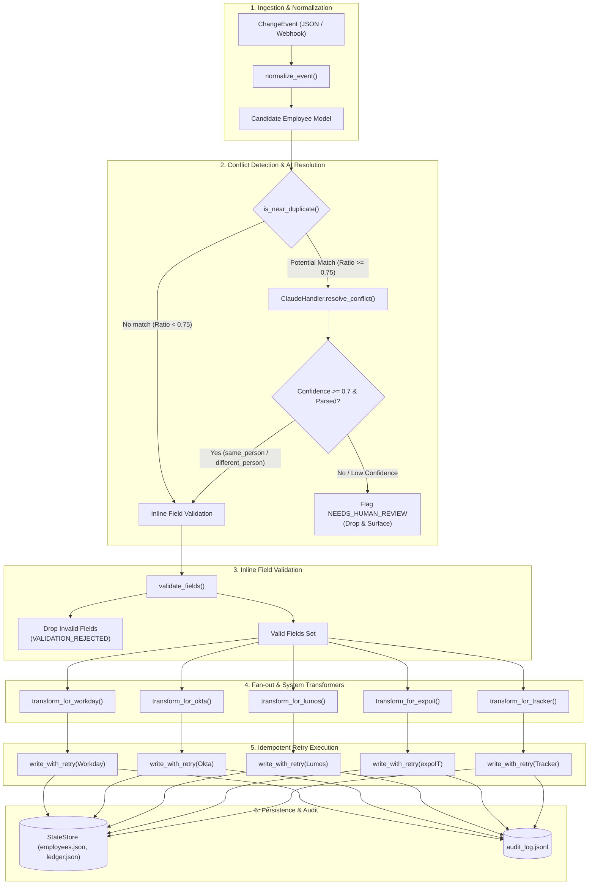
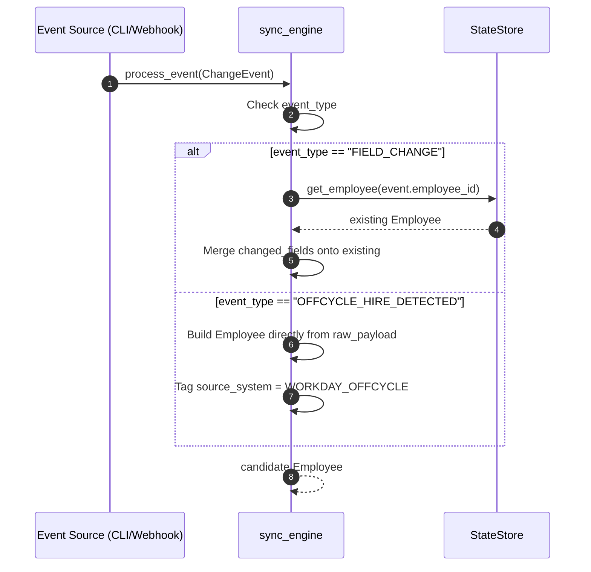
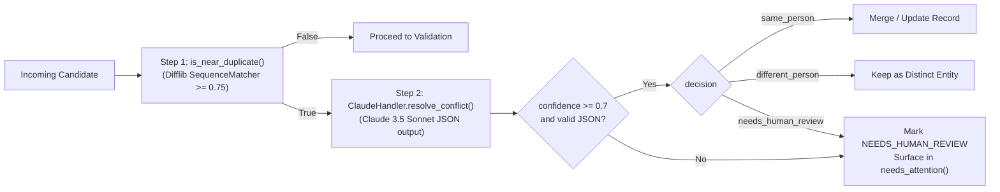
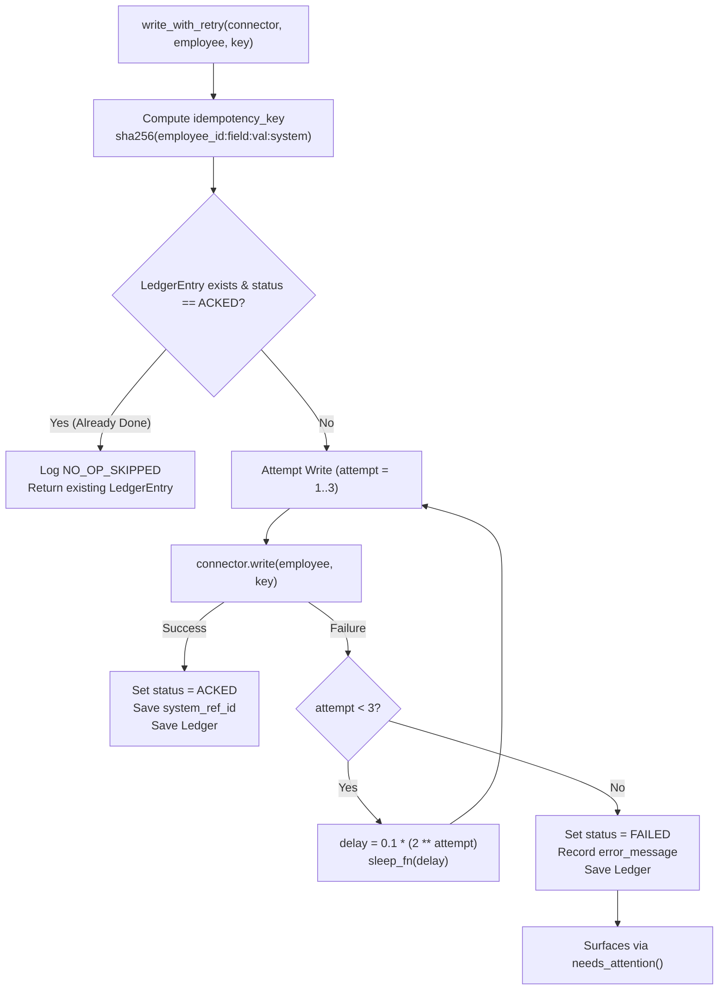
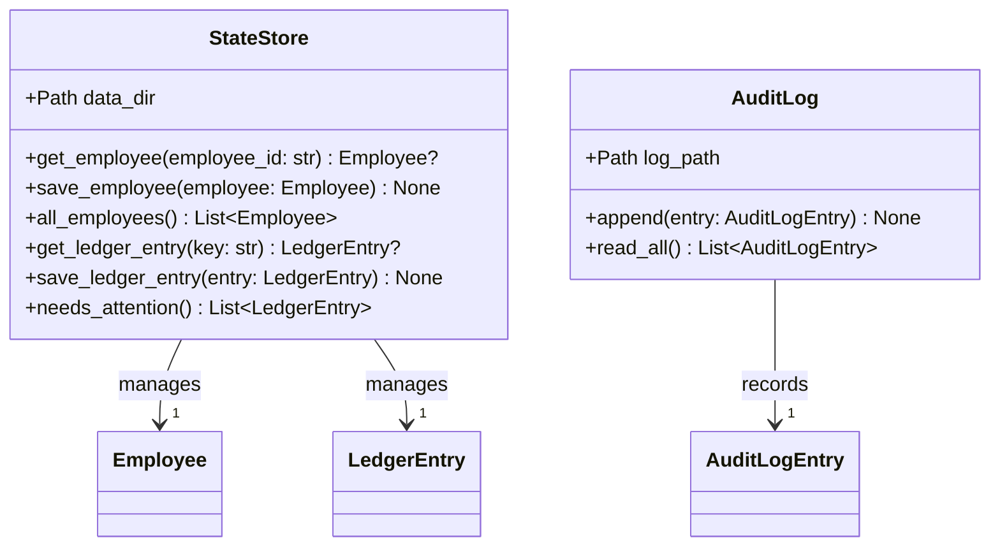
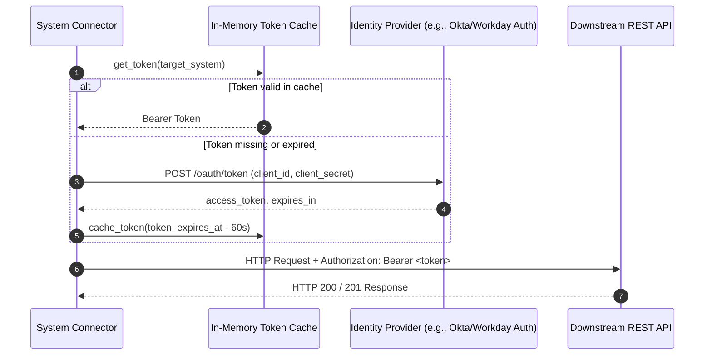
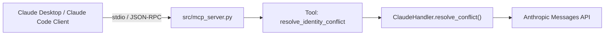
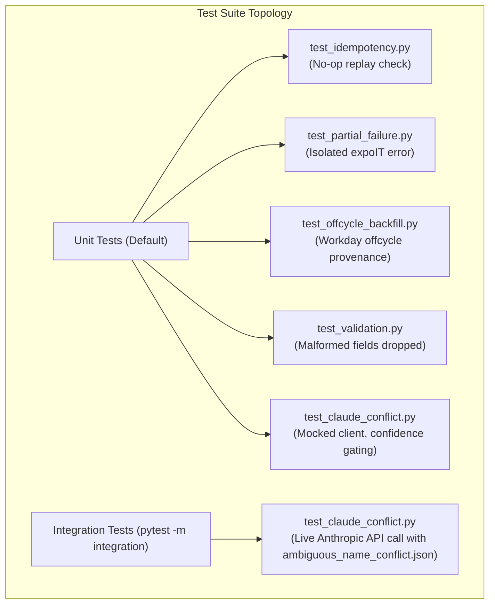

# BetterUp Sync Engine — System Architecture Specification

This document provides a comprehensive technical architecture description of the **BetterUp Change Propagation Sync Engine**, detailing data models, subsystem interactions, control flow, failure domains, idempotency guarantees, and AI-assisted ambiguity resolution.

---

## 1. Executive Architecture Summary

The BetterUp Sync Engine coordinates employee lifecycle changes across 5 downstream systems (**Workday, Okta, Lumos, expoIT, Cohort Tracker**) originating from upstream signals (**Ashby ATS** or **Workday Off-Cycle**).



---

## 2. Core Architectural Principles

1. **Change Propagation with Inline Validation**:
   Validation is performed directly during field transformation before dispatching downstream writes, ensuring invalid inputs are rejected without halting unaffected valid fields.
2. **Deterministic Pre-Filtering before LLM Gating**:
   LLMs are expensive and non-deterministic. A fast standard-library string similarity algorithm (`SequenceMatcher`) filters out 99%+ of routine traffic. Claude 3.5 Sonnet is invoked *only* when genuine ambiguity exists.
3. **Strict Downstream Idempotency & Fault Isolation**:
   Every downstream write is guarded by a deterministic SHA-256 key in an appendable Ledger. Per-system `try/except` wrappers guarantee that a failure in one connector (e.g. expoIT hardware failure) does not block writes to identity (Okta) or access governance (Lumos).
4. **Canonical Data Modeling (Pydantic v2)**:
   Strict typing and validation boundaries across all modules; no unstructured dictionaries cross internal boundaries.
5. **No Synthetic State Creation (Off-Cycle Design)**:
   Off-cycle hires originating in Workday without an Ashby antecedent are treated as canonical with `source_system = WORKDAY_OFFCYCLE`. Fictitious pre-hire records are never created.

---

## 3. Subsystem Breakdown & Contracts

### 3.1 Ingestion & Normalization (`sync_engine.py`)

Normalizes heterogeneous incoming events into the canonical `Employee` schema.



- **Drop No-Op Deltas**: Before any validation, if `delta.old_value == delta.new_value`, drop the delta and record `NO_OP_SKIPPED`.

---

### 3.2 Identity Resolution Pipeline (`validators.py` & `claude_handler.py`)

A two-tiered verification pipeline designed to detect near-duplicates and resolve name variations without manual human intervention unless required.



#### Deterministic Filter Rule (`is_near_duplicate`):
1. Returns `False` if `candidate.employee_id == existing.employee_id` (same record).
2. Returns `False` if `candidate.start_date != existing.start_date` (different hire cohorts).
3. Returns `False` if normalized names are exact matches (standard update flow).
4. Calculates `SequenceMatcher(None, name_a, name_b).ratio()`. If $\ge 0.75$, triggers Claude.

#### LLM Gating Rule:
- System prompt forces pure JSON response: `{"decision": "...", "confidence": 0.0-1.0, "reasoning": "..."}`.
- If JSON parsing fails OR `confidence < 0.70`, the system unconditionally overrides the decision to `needs_human_review`.

---

### 3.3 Inline Field Validation (`validators.py`)

Transforms and validates individual fields in isolation:

| Field | Rule | Rejection Behavior |
|---|---|---|
| `legal_first_name` | Non-empty string, no numeric digits | Field dropped; logs `VALIDATION_REJECTED` |
| `legal_last_name` | Non-empty string, no numeric digits | Field dropped; logs `VALIDATION_REJECTED` |
| `address` | `line1`, `city`, `state`, `postal_code`, `country` non-empty | Address group dropped; logs `VALIDATION_REJECTED` |
| `start_date` | Date cannot be before `event.received_at` date | Start date dropped; logs `VALIDATION_REJECTED` |

---

### 3.4 Idempotency & Resilient Retry Engine (`sync_engine.py`)

To prevent duplicate API invocations (such as duplicate laptop shipments or repeated email creations), all writes pass through an atomic Ledger check.



#### Mathematical Properties:
- **Idempotency Key Hash**:
  $$\text{Key} = \text{SHA256}(f\text{"}\{\text{employee\_id}\}:\{\text{field\_name}\}:\{\text{new\_value}\}:\{\text{target\_system}\}\text{"})$$
- **Exponential Backoff Schedule**:
  $$\Delta t_n = 0.1 \times 2^n \quad \text{for } n \in \{1, 2, 3\}$$
  - Attempt 1 failure: sleep $0.2\,\text{s}$
  - Attempt 2 failure: sleep $0.4\,\text{s}$
  - Attempt 3 failure: sleep $0.8\,\text{s} \rightarrow \text{FAILED}$

---

### 3.5 Storage & Ledger Persistence Architecture (`state_store.py` & `audit_log.py`)

All runtime state is stored in lightweight, zero-dependency, local file structures under `data/`:

```
data/
├── employees.json      # Keyed JSON Object: { "<employee_id>": { ...Employee } }
├── ledger.json         # Keyed JSON Object: { "<idempotency_key>": { ...LedgerEntry } }
└── audit_log.jsonl     # Append-Only JSON Lines: { ...AuditLogEntry }\n
```



---

## 4. Downstream Connector Specifications

Each connector adheres to the base interface contract:
```python
class Connector(ABC):
    @abstractmethod
    def write(self, employee: Employee, idempotency_key: str) -> ConnectorResult:
        pass
```

| Connector | Systems Handled | Payload Mappings | Failure Simulation |
|---|---|---|---|
| `fake_workday.py` | HRIS Record | `legal_name`, `address`, `start_date`, `position`, `department` | Returns `"WD-<hash>"` |
| `fake_okta.py` | SSO / Directory | `personal_email`, `legal_name` $\rightarrow$ Generates `work_email` | Returns `"OKTA-<hash>"` |
| `fake_lumos.py` | Access Governance | `department`, `position_title` $\rightarrow$ Role entitlements | Returns `"LUMOS-<hash>"` |
| `fake_expoit.py` | IT Laptop Fulfillment | `shipping_address`, `legal_name` | Throws error if `employee_id == 'emp_offcycle_test'` |
| `fake_tracker.py` | Cohort Tracking | Checklist lifecycle item updates | Returns `"TRK-<hash>"` |

---

## 5. Security & Authentication Architecture (Production Design)

For production deployment (as documented in `build_note.md`), connectors use **OAuth 2.0 Client Credentials Grant**:



- **Secrets Handling**: Credentials (`CLIENT_ID`, `CLIENT_SECRET`, `ANTHROPIC_API_KEY`) loaded strictly from environment or AWS Secrets Manager / HashiCorp Vault. Zero credentials committed to git.

---

## 6. Stretch Integration: Model Context Protocol (MCP) Server

An optional MCP server (`src/mcp_server.py`) exposes identity conflict resolution to desktop agents (Claude Code, Claude Desktop, Cursor):



---

## 7. Quality Assurance & Verification Topology



- **Speed Guarantee**: `sleep_fn = lambda _: None` allows the entire test suite including 3-attempt exponential retries to execute in $< 200\,\text{ms}$.
- **Air-Gapped Default**: Zero external API dependencies required for standard CI runs.