# BetterUp Sync Engine — Edge Cases & Mitigation Matrix

This document catalogs all critical edge cases across the data lifecycle of the BetterUp Change Propagation Sync Engine, along with their root causes, system behaviors, mitigation strategies, and corresponding test verifications.

---

## 1. Event Ingestion & Normalization Edge Cases

| ID | Scenario | Trigger Condition | System Behavior | Mitigation & Handling | Test Reference |
|---|---|---|---|---|---|
| **E-ING-01** | **No-Op Delta** | Incoming event contains `old_value == new_value` for a field | Delta is dropped prior to validation; logs `NO_OP_SKIPPED` in audit log | Filter in `normalize_event` / pre-validation; prevent unnecessary downstream API calls or ledger clutter | `test_validation.py` |
| **E-ING-02** | **Unknown Employee on FIELD_CHANGE** | `event_type == "FIELD_CHANGE"` but `employee_id` does not exist in `StateStore` | Rejects event or initializes fallback record with warning | `normalize_event` checks `store.get_employee(event.employee_id)`. If `None`, raises explicit `EmployeeNotFoundError` / logs `NEEDS_HUMAN_REVIEW` | `test_validation.py` |
| **E-ING-03** | **Off-Cycle Hire with Existing ID** | `event_type == "OFFCYCLE_HIRE_DETECTED"` with an `employee_id` already present | Throws collision or invokes conflict resolution | Flags potential ID collision; does not silently overwrite existing record without audit entry | `test_offcycle_backfill.py` |
| **E-ING-04** | **Malformed UTC Timestamps** | `received_at` missing timezone offset or `Z` suffix | Parsing error during Pydantic deserialization | Pydantic v2 `AwareDatetime` validator enforces ISO-8601 UTC representation | `test_validation.py` |
| **E-ING-05** | **Empty `changed_fields` in FIELD_CHANGE** | `changed_fields == {}` on a `FIELD_CHANGE` event | No-op event execution | Engine detects empty delta set, logs `NO_OP_SKIPPED`, and returns `ProcessResult` with 0 writes | `test_validation.py` |

---

## 2. Deterministic Near-Duplicate & Pre-Filter Edge Cases

| ID | Scenario | Trigger Condition | System Behavior | Mitigation & Handling | Test Reference |
|---|---|---|---|---|---|
| **E-DUP-01** | **Same Employee ID Update** | Incoming candidate has identical `employee_id` as existing record | `is_near_duplicate` returns `False` | Explicit check: `if candidate.employee_id == existing.employee_id: return False`. This is a normal update, not an ambiguous conflict. | `test_claude_conflict.py` |
| **E-DUP-02** | **Different Start Dates** | Candidate has similar name but different `start_date` (e.g. 2026-09-01 vs 2026-10-15) | `is_near_duplicate` returns `False` | Distinct hire cohort filter: `if candidate.start_date != existing.start_date: return False`. Prevents false positive LLM invocations. | `test_claude_conflict.py` |
| **E-DUP-03** | **Exact Name Match** | Incoming name is character-for-character identical (case-insensitive) | `is_near_duplicate` returns `False` | Exact match filter: `if name_a == name_b: return False`. Handled as regular sync, not ambiguous. | `test_claude_conflict.py` |
| **E-DUP-04** | **Similarity Ratio Boundary (0.749 vs 0.750)** | `SequenceMatcher.ratio()` yields exactly `0.749` vs `0.750` | `< 0.75` proceeds directly; $\ge 0.75$ triggers Gemini LLM | Strict numerical comparison: `ratio >= 0.75`. Ensures deterministic boundary behavior. | `test_claude_conflict.py` |
| **E-DUP-05** | **Whitespace & Case Variations** | Names have irregular whitespace (`"  Sanjay   Iyer "`) or mixed casing (`"sAnJaY IYER"`) | Normalized before similarity calculation | Names are stripped and lowercased: `f"{first} {last}".lower().strip()` before computing ratio. | `test_claude_conflict.py` |
| **E-DUP-06** | **Multiple Near-Duplicate Matches** | New hire matches 2 or more existing employees in `StateStore` | Gemini evaluated against all candidate matches | Engine aggregates conflicts; any unresolved conflict halts propagation and flags `NEEDS_HUMAN_REVIEW`. | `test_claude_conflict.py` |

---

## 3. Google Gemini Conflict Resolution & Safety Gating Edge Cases

| ID | Scenario | Trigger Condition | System Behavior | Mitigation & Handling | Test Reference |
|---|---|---|---|---|---|
| **E-LLM-01** | **Low Confidence Response** | Gemini returns `confidence: 0.65` with `decision: "same_person"` | Force-overridden to `needs_human_review` | Safety rule: If `confidence < 0.70`, override `decision = "needs_human_review"`. Prevents low-confidence auto-merging. | `test_claude_conflict.py` |
| **E-LLM-02** | **Malformed JSON from LLM** | Gemini returns markdown fences, conversational filler, or invalid JSON syntax | Parsing failure triggers fallback to `needs_human_review` | `try/except json.JSONDecodeError` catches syntax errors; creates fallback `ConflictResolution(decision="needs_human_review", confidence=0.0, reasoning="JSON parse error")`. | `test_claude_conflict.py` |
| **E-LLM-03** | **Unexpected Decision String** | Gemini returns `decision: "maybe"` or non-standard enum | Schema validation triggers fallback | Pydantic validation on `ConflictResolution` catches invalid literals, defaulting to `needs_human_review`. | `test_claude_conflict.py` |
| **E-LLM-04** | **API Rate Limit / Timeout / Outage** | Google Gemini API returns HTTP 429 / 500 or network timeout | Exception caught gracefully | Connector wraps API call in `try/except Exception`; logs error and safely flags `NEEDS_HUMAN_REVIEW` without crashing engine. | `test_claude_conflict.py` |
| **E-LLM-05** | **Confidence Out of Bounds** | Gemini returns `confidence: 1.5` or `-0.1` | Clamped / Validated via Pydantic | Pydantic field constraint `Field(ge=0.0, le=1.0)` enforces valid probability range. | `test_claude_conflict.py` |
| **E-LLM-06** | **Air-Gapped Test Isolation** | Running unit tests in air-gapped CI/CD without API keys | `FakeGeminiClient` injected via `conftest.py` | Zero network dependency; canned JSON fixtures return deterministic outcomes in $<1.5\text{s}$. | `test_claude_conflict.py` |

---

## 4. Inline Field Validation Edge Cases

| ID | Scenario | Trigger Condition | System Behavior | Mitigation & Handling | Test Reference |
|---|---|---|---|---|---|
| **E-VAL-01** | **Partial Event Failure (Multi-Field)** | Event contains valid `legal_first_name` and invalid `address` (missing postal code) | `address` is dropped; `legal_first_name` propagates downstream | Field-level validation isolation: `validate_fields` returns `(valid_fields, rejection_logs)`. Only valid fields fan out. | `test_validation.py` |
| **E-VAL-02** | **Numeric Digits in Legal Names** | Name contains numbers (e.g. `"Naveen 2nd"`, `"Elon123"`) | Field rejected (`VALIDATION_REJECTED`) | Rule: `any(char.isdigit() for char in name)` triggers validation rejection. | `test_validation.py` |
| **E-VAL-03** | **Empty or Whitespace-Only Name** | Name is `""` or `"   "` | Field rejected (`VALIDATION_REJECTED`) | Rule: `not name.strip()` triggers validation rejection. | `test_validation.py` |
| **E-VAL-04** | **Incomplete Address Structure** | Address missing `line1`, `city`, `state`, `postal_code`, or `country` | Address group rejected (`VALIDATION_REJECTED`) | Check ensures all 5 mandatory address sub-fields are present and non-empty after stripping. | `test_validation.py` |
| **E-VAL-05** | **Start Date Precedes Event Timestamp** | `start_date` is `2026-08-01` but `received_at` is `2026-08-20` | `start_date` rejected (`VALIDATION_REJECTED`) | Calendar date comparison: `start_date < received_at.date()` flags invalid backdated changes. | `test_validation.py` |

---

## 5. Downstream Idempotency & Fault Isolation Edge Cases

| ID | Scenario | Trigger Condition | System Behavior | Mitigation & Handling | Test Reference |
|---|---|---|---|---|---|
| **E-IDP-01** | **Event Replay / Duplicate Webhook** | Identical `ChangeEvent` processed twice | Second run makes 0 downstream API calls; logs `NO_OP_SKIPPED` | SHA-256 key lookup in `ledger.json`. If status is `ACKED`, connector call is bypassed completely. | `test_idempotency.py` |
| **E-IDP-02** | **Partial Downstream System Failure** | 4 connectors succeed, but `fake_expoit` raises transient error | Workday, Okta, Lumos, Tracker reach `ACKED`; expoIT reaches `FAILED` | Per-connector `try/except` block. Failure in expoIT does not abort or roll back other system writes. | `test_partial_failure.py` |
| **E-IDP-03** | **Retry Recovery on Attempt 2 or 3** | Connector fails on attempt 1, succeeds on attempt 2 | Status transitions `PENDING` $\rightarrow$ `RETRYING` $\rightarrow$ `ACKED` | Exponential backoff `delay = 0.1 * (2 ** attempt)` with retry loop up to `max_attempts=3`. | `test_partial_failure.py` |
| **E-IDP-04** | **Exhausted Retries (Permanent Failure)** | Connector fails all 3 attempts | Status set to `FAILED`; error logged; surfaced via `needs_attention()` | Final attempt records exception message, timestamp, and sets terminal `FAILED` status in Ledger. | `test_partial_failure.py` |
| **E-IDP-05** | **Re-processing After Partial Failure** | Re-running engine after expoIT failure | Only expoIT is re-attempted; previously `ACKED` systems skipped | Each system has its own distinct `idempotency_key` based on `target_system`. | `test_idempotency.py` |

---

## 6. Persistence & Audit Log Resilience Edge Cases

| ID | Scenario | Trigger Condition | System Behavior | Mitigation & Handling | Test Reference |
|---|---|---|---|---|---|
| **E-STO-01** | **Missing Data Directory on First Run** | `data/` directory does not exist | Directory created automatically | `StateStore.__init__` executes `self.data_dir.mkdir(parents=True, exist_ok=True)`. | `test_validation.py` |
| **E-STO-02** | **Corrupted or Empty JSON State Files** | `employees.json` or `ledger.json` contains 0 bytes or invalid JSON | Gracefully initialized to `{}` | `_load_json` catches `FileNotFoundError` and `JSONDecodeError`, falling back to empty mapping `{}`. | `test_validation.py` |
| **E-STO-03** | **Concurrent Process Conflicts** | Two CLI instances writing to `data/` simultaneously | In-process safe file writing | Uses atomic write pattern (write to `.tmp` file then replace/rename) to prevent half-written files. | `test_idempotency.py` |
| **E-STO-04** | **Audit Log Append Integrity** | Continuous appending to `audit_log.jsonl` | Append-only newline-delimited JSON | Open file with mode `"a"`, write single-line JSON + `\n`. | `test_audit_log.py` |
| **E-STO-05** | **Corrupted Line in `audit_log.jsonl`** | File contains malformed/truncated line from external edit | Reader skips bad line, returns valid entries | `get_all_entries()` wraps line deserialization in `try/except json.JSONDecodeError` to prevent stream crashes. | `test_audit_log.py` |

---

## 7. Model Context Protocol (MCP) Server Edge Cases

| ID | Scenario | Trigger Condition | System Behavior | Mitigation & Handling | Test Reference |
|---|---|---|---|---|---|
| **E-MCP-01** | **Malformed Record Dicts in Tool Call** | External AI client calls `resolve_identity_conflict` with non-dict or malformed records | Returns safe `needs_human_review` payload without crashing server | MCP tool handler catches dictionary key/type errors and returns `{"decision": "needs_human_review", "confidence": 0.0, "reasoning": "Malformed record payload"}`. | `test_mcp_server.py` |
| **E-MCP-02** | **SDK Version Deprecations** | MCP SDK 2.0 refactored `fastmcp` import paths | Pinned SDK version in requirements | `requirements.txt` pins `mcp>=1.2.0,<2.0.0` ensuring stability for stdio tool handlers. | `test_mcp_server.py` |
| **E-MCP-03** | **Unauthenticated / Missing API Key in MCP** | Subagent invokes MCP tool without `GEMINI_API_KEY` | Gracefully flags for human review | Tool initializes `GeminiHandler` with fallback error trapping, returning actionable review advice. | `test_mcp_server.py` |

---

## 8. CLI, Web Dashboard & Cloud Deployment Edge Cases

| ID | Scenario | Trigger Condition | System Behavior | Mitigation & Handling | Test Reference |
|---|---|---|---|---|---|
| **E-CLI-01** | **Dry-Run Mode (`--dry-run`)** | User specifies `--dry-run` flag | Simulates normalization, duplicate checks, validation, and diffing without mutating state | Bypasses all `connector.write()`, `store.save_employee()`, and `store.save_ledger_entry()` calls. Prints planned actions. | `test_cli.py` |
| **E-CLI-02** | **Non-Existent Event File** | Path provided in `--event` does not exist | Returns exit code 1 with clean error message | Checks `os.path.exists(event_path)` before attempting execution. | `test_cli.py` |
| **E-CLI-03** | **Exit Code Signaling** | Any write failed or flagged for human review | Returns exit code `1`; returns `0` only if all actions cleanly `ACKED` | Aggregates results in `main()`. If any item is `FAILED` or `needs_human_review`, returns 1. | `test_cli.py` |
| **E-CLI-04** | **Custom Data Directory (`--data-dir`)** | User specifies `--data-dir /custom/path` | Directs all read/writes to custom directory | `StateStore(data_dir=Path(args.data_dir))` isolates runtime environments cleanly. | `test_cli.py` |
| **E-DEP-01** | **Dynamic Port Binding (Railway)** | Railway sets dynamic `$PORT` environment variable | Binds to `$PORT` automatically | `server.py` reads `int(os.environ.get("PORT", 8000))` and binds to `0.0.0.0`. | `server.py` |
| **E-DEP-02** | **SPA Sub-Route 404s (Vercel)** | Direct navigation to deep URLs or asset requests on Vercel | Serves `index.html` via client-side routing | `vercel.json` specifies `"outputDirectory": "frontend"` and rewrites all non-static paths to `/index.html`. | `vercel.json` |
| **E-DEP-03** | **CORS Request from Vercel to Railway** | Browser dispatches cross-origin fetch from Vercel frontend | Allowed with pre-flight response | `server.py` configures `CORSMiddleware` with `allow_origins=["*"]`, `allow_methods=["*"]`, and `allow_headers=["*"]`. | `server.py` |

---

## 9. Summary: Edge Case Filtration Pipeline

```mermaid
graph TD
    subgraph EdgeCaseFilters["Edge Case Filtration Layers"]
        EC1["1. Event Normalization: No-op delta drop (E-ING-01..05)"] --> EC2["2. Near-Duplicate Pre-Filter: Start date & ID checks (E-DUP-01..06)"]
        EC2 --> EC3["3. Gemini AI Safety Gate: Parse error & confidence < 0.70 (E-LLM-01..06)"]
        EC3 --> EC4["4. Inline Validation: Malformed field drop (E-VAL-01..05)"]
        EC4 --> EC5["5. Idempotency Check: SHA-256 Ledger check (E-IDP-01)"]
        EC5 --> EC6["6. Isolated Retry: System try/except + exp backoff (E-IDP-02..05)"]
        EC6 --> EC7["7. Persistence & MCP: Safe writes & tool gating (E-STO-01..05, E-MCP-01..03)"]
        EC7 --> EC8["8. Status & Alerting: needs_attention() & CLI codes (E-IDP-04, E-CLI-01..04, E-DEP-01..03)"]
    end
```

