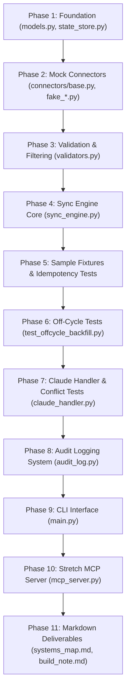

# Phase-Wise Implementation Plan: BetterUp Sync Engine (Change Propagation)

Implement the end-to-end Change Propagation prototype for BetterUp onboarding synchronization, adhering strictly to the phase order, function signatures, constraints, and acceptance criteria outlined in [context.md](file:///c:/Projects/Sync%20engine%20-%20BetterUp/context.md) and [architecture.md](file:///c:/Projects/Sync%20engine%20-%20BetterUp/architecture.md).

---

## 1. Summary of Constraints & Rules

- **Dependencies**: Only `pydantic>=2.0,<3.0`, `anthropic>=0.40.0`, `pytest>=8.0`, and `python-dotenv>=1.0` (with optional `mcp` for stretch).
- **Execution Strategy**: Strict sequential build in 11 phases.
- **Air-Gapped Default Suite**: All unit tests run against in-memory/JSON fixtures with zero API calls. Live Anthropic API testing is strictly gated under `pytest -m integration`.
- **Fast Execution**: `sleep_fn = lambda _: None` used in tests for instant retry cycles.

---

## 2. Phase-by-Phase Roadmap

---

### Phase 1: Canonical Data Models & State Store
- **Objectives**: Define Pydantic v2 data models and local JSON persistence layer.
- **Components**:
  - `requirements.txt`, `.env.example`, `pytest.ini`
  - `src/models.py`: `Address`, `Employee`, `FieldDelta`, `ChangeEvent`, `LedgerEntry`, `AuditLogEntry`, `ConflictResolution`, `ProcessResult`.
  - `src/state_store.py`: `StateStore` with atomic file updates for `data/employees.json` and `data/ledger.json`, plus `needs_attention()`.

---

### Phase 2: Downstream Connector Fakes
- **Objectives**: Implement downstream connector interfaces and mock implementations.
- **Components**:
  - `src/connectors/base.py`: `Connector` abstract base class and `ConnectorResult`.
  - `src/connectors/fake_workday.py`: HRIS mock.
  - `src/connectors/fake_okta.py`: Identity and email provisioning mock.
  - `src/connectors/fake_lumos.py`: Access governance mock.
  - `src/connectors/fake_expoit.py`: Hardware shipment mock with deterministic error on `emp_offcycle_test`.
  - `src/connectors/fake_tracker.py`: Cohort tracker mock.

---

### Phase 3: Inline Field Validation & Deterministic Pre-Filtering
- **Objectives**: Build field-level validation and fast non-LLM near-duplicate detection.
- **Components**:
  - `src/validators.py`:
    - `validate_fields(employee: Employee, changed_field_names: set[str]) -> tuple[set[str], list[AuditLogEntry]]` (drops malformed fields without blocking valid fields).
    - `is_near_duplicate(candidate: Employee, existing: Employee) -> bool` (SequenceMatcher ratio $\ge 0.75$ for same start date, different employee ID).

---

### Phase 4: Sync Engine Core Orchestration
- **Objectives**: Implement event normalization, idempotency checking, retry backoff, and downstream fan-out.
- **Components**:
  - `src/sync_engine.py`:
    - `normalize_event(event: ChangeEvent, store: StateStore) -> Employee` (with no-op delta drop on `old_value == new_value`).
    - `write_with_retry(connector, employee, idempotency_key, store, max_attempts=3, sleep_fn=time.sleep) -> LedgerEntry`.
    - `process_event(event, store, connectors, claude_handler=None) -> ProcessResult`.

---

### Phase 5: Sample Event Fixtures & Core Test Suite
- **Objectives**: Create literal sample event files and verify idempotency and fault isolation.
- **Components**:
  - `sample_events/name_change.json`
  - `sample_events/address_change.json`
  - `sample_events/start_date_change.json`
  - `sample_events/offcycle_hire.json`
  - `sample_events/ambiguous_name_conflict.json`
  - `tests/conftest.py`: `seeded_store`, `no_sleep`, `fake_anthropic_client`.
  - `tests/test_idempotency.py`: Replay verification asserting single write per downstream.
  - `tests/test_partial_failure.py`: Partial failure isolation verification.
  - `tests/test_validation.py`: Malformed field dropping verification.

---

### Phase 6: Off-Cycle Direct Hire Provenance
- **Objectives**: Verify Workday off-cycle hire detection without synthetic Ashby records.
- **Components**:
  - `tests/test_offcycle_backfill.py`: Confirms `source_system="WORKDAY_OFFCYCLE"` and direct record creation.

---

### Phase 7: Claude Conflict Handler & LLM Gating Tests
- **Objectives**: Implement Claude 3.5 Sonnet conflict resolution with confidence safety gating.
- **Components**:
  - `src/claude_handler.py`: `ClaudeHandler` with exact prompts, JSON parsing, and confidence gating ($<0.70 \rightarrow \text{needs\_human\_review}$).
  - `tests/test_claude_conflict.py`:
    - Unit tests with fake Anthropic client (`same_person`, `different_person`, low confidence override).
    - Integration test (`@pytest.mark.integration`) for live API run against `ambiguous_name_conflict.json`.

---

### Phase 8: Append-Only Audit Logging
- **Objectives**: Track state changes and system actions in append-only JSONL.
- **Components**:
  - `src/audit_log.py`: `AuditLog` writing to `data/audit_log.jsonl`.
  - Wire audit logging through `sync_engine.py`, `validators.py`, and `claude_handler.py`.

---

### Phase 9: CLI Interface & Dry-Run
- **Objectives**: Provide a production-like CLI with full dry-run capability.
- **Components**:
  - `src/main.py`: CLI supporting `--event <path>`, `--data-dir <path>`, `--dry-run`, returning exit code 0 or 1.

---

### Phase 10: Stretch Goal — Model Context Protocol (MCP) Server
- **Objectives**: Expose identity conflict resolution via stdio MCP.
- **Components**:
  - `src/mcp_server.py`: `resolve_identity_conflict` tool wrapping `ClaudeHandler`.

---

### Phase 11: Deliverables & Documentation
- **Objectives**: Complete required markdown deliverables matching Section 19 header templates.
- **Components**:
  - `systems_map.md`
  - `build_note.md`
  - `README.md`

---

## 3. Verification & Acceptance Checklist

| Check | Target | Test / Verification Method |
|---|---|---|
| Idempotency | Replay `name_change.json` | `test_idempotency.py` (exactly 1 write) |
| Fault Isolation | Forced expoIT error | `test_partial_failure.py` (Workday/Okta ACKED, expoIT FAILED) |
| Off-Cycle Handling | `offcycle_hire.json` | `test_offcycle_backfill.py` (`WORKDAY_OFFCYCLE`) |
| Near-Duplicate Filter | `emp_2002` vs `emp_2001` | `test_claude_conflict.py` (ratio $\ge 0.75$) |
| LLM Confidence Gating | Fake response $< 0.7$ | `test_claude_conflict.py` (`needs_human_review`) |
| Dry Run | `--dry-run` flag | CLI test (no writes, no state mutation) |
| Fast Suite | Entire unit test suite | `pytest` in $< 200\,\text{ms}$ with `no_sleep` |
